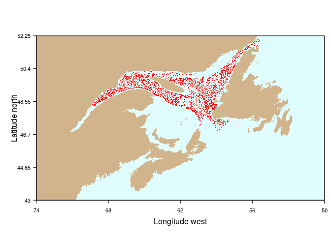
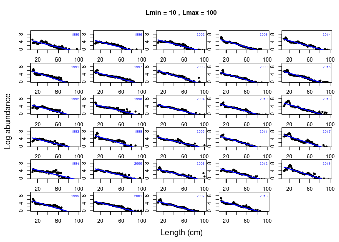
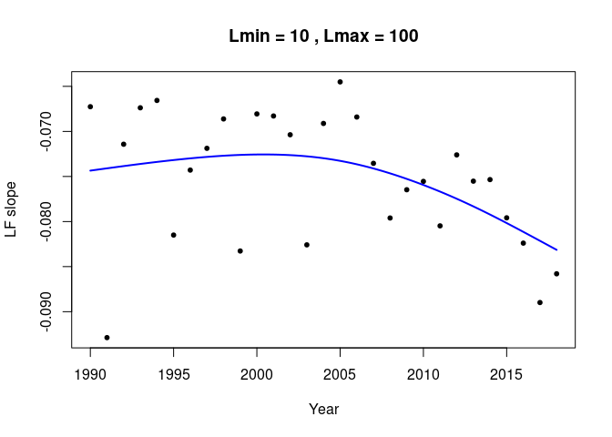
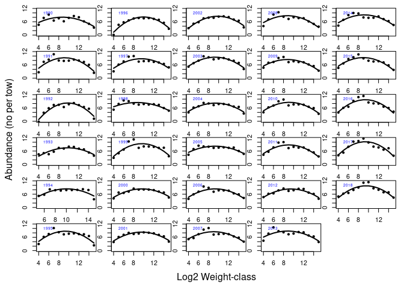
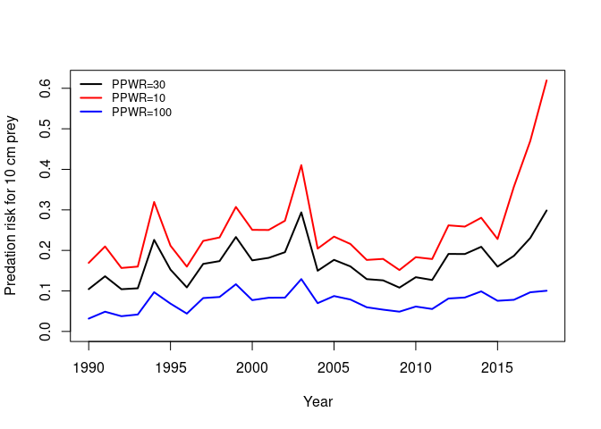
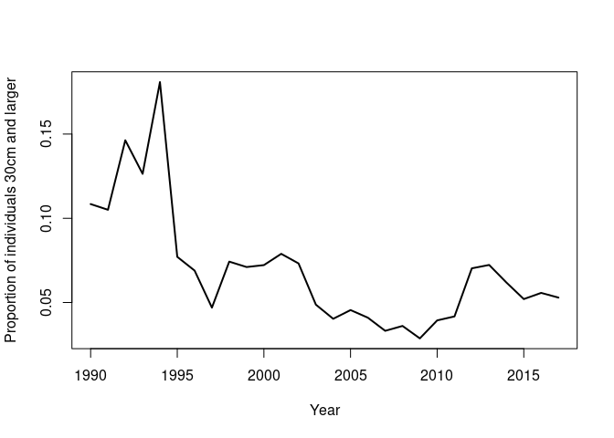

Install and load package
------------------------

    library(devtools)
    install_github("duplisea/size")

Load the package

    library(size)

Plot the survey locations on a map of the Gulf
----------------------------------------------

    map.f()
    points(-decdeg.f(ngsl.set$lon_deb*100),decdeg.f(ngsl.set$lat_deb*100),pch=".",col="red")

The length frequency spectrum of the northern Gulf fish and invertebrate community using length classes
-------------------------------------------------------------------------------------------------------

Use length cutoffs so catches outside of individuals between 10 cm and
100 cm is used.

    LFS= CLF.f("all")
    plot(LFS, 10, 100)

These are kind of boring plots without a lot of information for analysis
but they are more diagnostics. They do act as a quick visualisation of
the data and you can spot outliers quickly and figure out if they are
real and further investigate them. You should not be trying to force a
straight line through data that are clearly not linear.

    LFS.lm= CLF.lm.fit(LFS, 10, 100)
    plot(LFS.lm)

Fit linear models to the distribution each year and then plot the slopes
and run a gam trend line through them. The interpretation on these kinds
of plots is that the more negative the slope is, the fewer large fish
there are relative to smaller ones. So for example fisheries which
target large individuals may be reducing their abundance to such a
degree that there is a paucity of individuals of large sizes over the
whole community. It raises the idea of whether there is a slope which is
ideal for a particular system and invokes ideas related to balanced
fishing strategies, i.e. should we be targetting individuals over a
large range of sizes so that the system is not “out of balance” given
the size dependence of many physiological processes of individuals and
ecological processes in marine communities.

Size spectrum of the northern Gulf fish and invertebrate community using log2 weight classes
--------------------------------------------------------------------------------------------

Numbers per haul in log2 weight categories

    tmp= SS.f("all",codeqc=792)
    tmp$labundance= log2(tmp$abundance)
    tmp$lbiomass= log2(tmp$biomass)
    tmp= tmp[tmp$lg2W>3 & tmp$lg2W<16,]

    par(mfcol=c(6,5),mar=c(1,1,1,1),omi=c(.5,.5,.01,.01))
    years= sort(unique(tmp$year))
    for (y in years){
      tmp2= tmp[tmp$year==y,]
      plot(tmp2$lg2W,tmp2$labundance,type="p",,ylim=c(0,max(tmp$labundance)), xlab="", ylab="", pch=20)
      nss.quad= lm(labundance~ poly(lg2W,2),data=tmp2)
      lines(tmp2$lg2W,predict(nss.quad),lwd=2)
      legend("topleft",legend=y,cex=0.6,bty="n",text.col="blue")
    }
    mtext(side=1,text="Log2 Weight-class",outer=T,line=2)
    mtext(side=2,text="Abundance (no per tow)",outer=T,line=2)

The predation size spectrum
---------------------------

Given the predator size distribution in the system in a year, the
average predator/prey weight ratio and the variance (cv) of this this,
the exponent relating consumption rate to body weight for a predator,
the predation size spectrum can be determined. This is like a predation
risk or the sizes of prey that would be most likely targetted by
predators in the system in a year.

type ?PSS.f to see why I suppressed the warnings and I do not want them
to appear in this markdown file.

    pss= suppressWarnings(PSS.f("all",PPWR=10))
    pss.scaled= pss$pred.risk/max(pss$pred.risk)
    prey.size=10
    plot(pss$year, pss.scaled[prey.size,],type="l",lwd=2,   ylim=c(0,max(pss.scaled[prey.size,])),col="red",xlab="Year",ylab="Predation risk for 10 cm prey")

    pss= suppressWarnings(PSS.f("all",PPWR=100))
    pss.scaled= pss$pred.risk/max(pss$pred.risk)
    lines(pss$year, pss.scaled[prey.size,],lwd=2,col="blue")

    pss= suppressWarnings(PSS.f("all",PPWR=30))
    pss.scaled= pss$pred.risk/max(pss$pred.risk)
    lines(pss$year, pss.scaled[prey.size,],lwd=2,col="black")

    legend("topleft",bty="n",lwd=2,col=c("black","red","blue"),lty=1,legend=c("PPWR=30","PPWR=10","PPWR=100"),cex=0.8)

What you see is essentially the impact of the huge redfish year-class
from 2011 becoming predators. if the PPWR is 10 then this year class
starts having a large impacts on 10 cm prey by 2018 but if the PPWR is
30, prey of 10 cm are still mostly too large for this year class of
redfish. The increase in predation risk will come further along. If the
PPWR is 100, then there the predation index is much less dynamic. This
is because the predators are not only quite different in size than their
prey but the spread of prey sizes they target is also larger and
therefore the predation impact of any particular predator cohort is much
more diffuse over length classes.

PLF analysis with the installed dataset
---------------------------------------

The PLF for all species with a 30 cm threshold between small and large
individuals

    PLF.all= PLF.f(species.group="all",cutoff=30)

The PLF for all species with a 30 cm threshold between small and large
individuals

    PLF.dem= PLF.f(species.group="demersal",cutoff=30)

The PLF for all species with a 30 cm threshold between small and large
individuals

    PLF.gf= PLF.f(species.group="groundfish",cutoff=30)

The PLF for all species with a 30 cm threshold between small and large
individuals

    PLF.rf= PLF.f(species.group="code",codeqc=792,cutoff=20)

Plot the various PLF community indicators

    ymax=max(c(PLF.all$plf,PLF.dem$plf,PLF.gf$plf))
    plot(PLF.all$year, PLF.all$plf,xlab="Year",ylab="Proportion of individuals >=30cm",type="l",lwd=2,
      ylim=c(0,ymax))
    lines(PLF.dem$year,PLF.dem$plf,col="blue",lwd=2)
    lines(PLF.gf$year,PLF.gf$plf,col="green",lwd=2)
    legend("topright",lwd=2,col=c("black","blue","green"),legend=c("everything","demersal","groundfish"),bty="n",cex=0.6)

References
----------

Duplisea, D.E. 2005. Running the gauntlet: the predation environment of
small fish in the northern Gulf of St Lawrence, Canada. ICES Journal of
Marine Science 62: 412-416

Duplisea, D.E. and Castonguay, M. 2006. Comparison and utility of
different size-based metrics of fish communities for detecting fishery
impacts. Canadian Journal of Fisheries and Aquatic Sciences 63: 810-820.

Greenstreet, S.P., Rogers, S.I., Rice, J.C., Piet, G.J., Guirey, E.J.,
Fraser, H.M. and Fryer, R.J. 2010. Development of the EcoQO for the
North Sea fish community. ICES Journal of Marine Science 68: 1-11.

Hahm, W. and Langton, R. 1984. Prey selection based on predator/prey
weight ratios for some Northwest Atlantic fish. Marine Ecology Progress
Series 19: 1-5.

