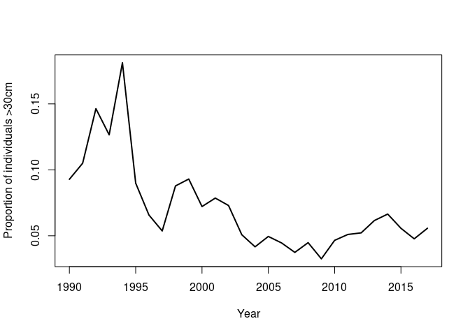
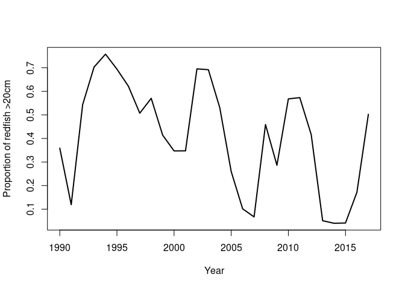

Install and load package
------------------------

    library(devtools)
    install_github("duplisea/size")

Load the package

    library(size)

Plot the survey locations on a map of the Gulf
----------------------------------------------

    map.f()
    points(-decdeg.f(ngsl.set$lon_deb*100),decdeg.f(ngsl.set$lat_deb*100),pch=".",col="red")

PLF analysis with the installed dataset
---------------------------------------

The PLF for all species with a 30 cm threshold between small and large
individuals

    PLF.all= PLF.f(species.group="all",cutoff=30)
    plot(PLF.all$year, PLF.all$plf,xlab="Year",ylab="Proportion of individuals >30cm",type="l",lwd=2)

 The redfish plf at
20 cm threshold

    PLF.all= PLF.f(species.group="code",code.qc=792,cutoff=20)
    plot(PLF.all$year, PLF.all$plf,xlab="Year",ylab="Proportion of redfish >20cm",type="l",lwd=2)

