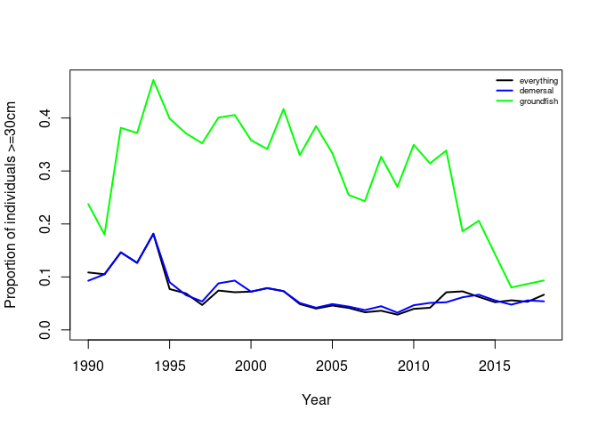

Install and load package
------------------------

    library(devtools)
    install_github("duplisea/size")

Load the package

    library(size)

PLF analysis with the installed dataset
---------------------------------------

The PLF for all species with a 30 cm threshold between small and large
individuals

    PLF.all= PLF.f(ngsl.plf.data,species.group="all",cutoff=30)

Plot the various PLF community indicators

    plot(PLF.all$year, PLF.all$plf,xlab="Year",ylab="Proportion of fish 30cm and larger",type="l",lwd=2)

